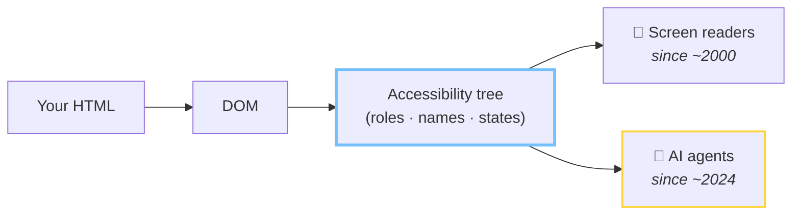

# Three ways to read a page

<v-clicks>

  <h3>👁 Screenshots + vision</h3>
  
🖼️

  <ul>
    <li>expensive — every step is an image</li>
    <li>slow — model round-trip per glance</li>
    <li>misreads dense layouts</li>
  </ul>

  <h3>🧾 Raw DOM</h3>
  
&lt;div&gt;&lt;div&gt;&lt;div&gt;&lt;span&gt; &lt;div class="x9k"&gt;&lt;div&gt; &lt;div&gt;&lt;div&gt;&lt;svg&gt;…

  <ul>
    <li>thousands of noisy nodes</li>
    <li>wrappers, framework junk, no meaning</li>
  </ul>

  <h3>🌳 Accessibility tree</h3>
  
heading "TrailRunner 3000" button "Add to cart" textbox "Email" (required)

  <ul>
    <li>clean semantic map</li>
    <li><strong>roles, names, states</strong> — nothing else</li>
  </ul>

</v-clicks>

Source: Google web.dev, "Build agent-friendly websites" · 2026 · AX-tree parsing reported ~93% more token-efficient than raw DOM (isagentready.com)

<!--
⏱ 4:00 — Section B: how agents see the web.

Same product page, three ways to read it.

[click] Vision: the agent screenshots your page and asks a model "what do you see?". Works, but it's the most expensive and slowest path, and dense UI gets misread. It's how agents read sites that give them nothing better.

[click] Raw DOM: free to fetch, horrible to consume. Your checkout is three thousand nodes of divs and framework wrappers. Finding "the pay button" in that is archaeology.

[click] And then there's a third representation the browser has been maintaining for 25 years: the accessibility tree. Roles, names, states. A semantic map with all the noise already stripped. web.dev's own guidance for "agent-friendly websites" is, almost line for line, an accessibility guide.

[click] One blog measured AX-tree parsing at roughly 93% fewer tokens than raw DOM. Cheaper, faster, more reliable. If you were building an agent, which would you pick?
-->

---

# The pipeline

Same tree. New consumer.

<!--
The browser parses your HTML into the DOM, and from the DOM it derives the accessibility tree — roles, names, states, relationships.

For two decades that tree had one audience: assistive technology. Screen readers, switch devices, voice control.

[click] Since about 2024 it has a second audience, and this one arrives with a credit card. Same tree. New consumer. Everything you ever did for the first audience, the second one inherits for free.
-->

---

# Don't take my word for it

<v-clicks>

  <h3>ChatGPT Atlas · OpenAI</h3>
  
Queries the accessibility tree for <strong>roles + accessible names</strong> to find elements.

  <h3>Playwright MCP · Microsoft</h3>
  
Deliberately ships <strong>accessibility snapshots</strong> instead of screenshots as the default page representation.

  <h3>Claude in Chrome · Anthropic</h3>
  
Documents its page-reading tool as returning an <strong>accessibility-tree representation</strong> of the page.

  <h3>Computer-Using Agent · OpenAI</h3>
  
Hybrid: vision + DOM + AX tree, <strong>prioritizing ARIA</strong> data when it's there.

</v-clicks>

Sources: vendor docs & READMEs · nohacks.co "How AI agents see your website" · 2026

<!-- TODO(Tim): pick real X/Bluesky post IDs and/or capture doc screenshots into public/, then swap these cards for <PostEmbed fallback="/vendor-atlas.png" postUrl="…" /> -->

<!--
Receipts from the people actually building these agents — because "trust me" is not evidence.

[click] OpenAI's Atlas browser: element lookup via the accessibility tree, role plus accessible name. That's a screen-reader query.

[click] Microsoft's Playwright MCP — the thing half the agent startups are built on — made accessibility snapshots the default *on purpose*. Not screenshots. They wrote it down.

[click] Anthropic documents Claude in Chrome's page-reading tool as returning an accessibility-tree representation.

[click] And OpenAI's CUA is the honest picture: hybrid. Vision plus DOM plus AX tree, ARIA prioritized. Keep that word "hybrid" in mind — I'll come back to it in the fine print, because I'm not going to oversell this.
-->

---

# See it yourself — no agent required

1. Chrome DevTools → **Elements**
2. Sidebar → **Accessibility** pane
3. Settings → *"Enable full-page accessibility tree"* for the whole-tree view

This pane used to be the loneliest tab in DevTools. It's now your agent analytics.

  
📸 Annotated DevTools screenshot of the Veldloper product page

  
accessibility pane, tree view expanded

<!-- TODO(Tim): capture DevTools accessibility-pane screenshot of the Veldloper demo shop into public/devtools-ax.png and replace the placeholder -->

<!--
You don't need an agent SDK to see what agents see. It's been in DevTools the whole time.

Elements panel, Accessibility pane — and the good stuff is behind the settings flag: the full-page accessibility tree toggle, which swaps the DOM tree for the AX tree.

[click] This pane used to be the loneliest tab in DevTools — the one you opened by accident. It's now your agent analytics. Open it on your own checkout tonight. What you'll see there is the rest of this talk.
-->

---

# Live: what the agent sees

<AgentView snippet="product-card" variant="fixed" height="330px" />

<!--
⏱ 9:00 — Live demo 1. Establish the tool calmly; the breakage comes later.

This panel is the rig for the rest of the talk. Left: HTML, editable. Middle: what humans see. Right: the accessibility tree — computed live from the rendered DOM, same accname algorithm the browser uses.

Read the tree out loud: heading "TrailRunner 3000" level 1. The image announces its alt text. The price is real text. And a button, role button, name "Add to cart — €189".

An agent needs exactly three questions answered: what is it (role), what's it called (name), what state is it in. This page answers all three. This is the *fixed* version, by the way. Enjoy the calm — next we go shopping on the version your deadline wrote.
-->
