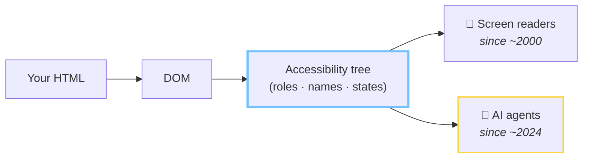

# Three ways to read a page

<div class="three-col">
<v-clicks>

<div class="read-card">
  <h3>👁 Screenshots + vision</h3>
  <div class="read-viz" aria-hidden="true">🖼️</div>
  <ul>
    <li>expensive</li>
    <li>slow</li>
    <li>misreads dense layouts</li>
  </ul>
</div>

<div class="read-card">
  <h3>🧾 Raw DOM</h3>
  <div class="read-viz mono" aria-hidden="true">&lt;div&gt;&lt;div&gt;&lt;div&gt;&lt;span&gt;<br>&lt;div class="x9k"&gt;&lt;div&gt;<br>&lt;div&gt;&lt;div&gt;&lt;svg&gt;…</div>
  <ul>
    <li>thousands of noisy nodes</li>
    <li>wrappers, framework junk, no meaning</li>
  </ul>
</div>

<div class="read-card ring-accent-card">
  <h3>🌳 Accessibility tree</h3>
  <div class="read-viz mono" aria-hidden="true">heading "TrailRunner 3000"<br>button "Add to cart"<br>textbox "Email" (required)</div>
  <ul>
    <li>clean semantic map</li>
    <li><strong>roles, names, states</strong> — nothing else</li>
  </ul>
</div>

</v-clicks>
</div>

<p v-click class="punch-sm">A fourth path is being built: the site <em>declares</em> callable tools for agents — WebMCP.</p>

<p v-click class="src-note">Source: Google web.dev, "Build agent-friendly websites" · 2026 · AX-tree parsing reported ~93% more token-efficient than raw DOM (isagentready.com)</p>

<!--
⏱ 4:00 — Section B: how agents see the web.

Same product page, three ways to read it.

[click] Vision: the agent screenshots your page and asks a model "what do you see?". Works, but it's the most expensive and slowest path, and dense UI gets misread. It's how agents read sites that give them nothing better.

[click] Raw DOM: free to fetch, horrible to consume. Your checkout is three thousand nodes of divs and framework wrappers. Finding "the pay button" in that is archaeology.

[click] And then there's a third representation the browser has been maintaining for 25 years: the accessibility tree. Roles, names, states. A semantic map with all the noise already stripped. web.dev's own guidance for "agent-friendly websites" is, almost line for line, an accessibility guide.

[click] There is a fourth path under construction: the site declaring callable tools for agents, WebMCP. It is opt-in per site and barely deployed, so it does not change this comparison — the fine print near the end covers it.

[click] One blog measured AX-tree parsing at roughly 93% fewer tokens than raw DOM. Cheaper, faster, more reliable. If you were building an agent, which would you pick?
-->

---

# The pipeline



<p v-click class="punch">Same tree. New consumer.</p>

<!--
The browser parses your HTML into the DOM, and from the DOM it derives the accessibility tree — roles, names, states, relationships.

For two decades that tree had one audience: assistive technology. Screen readers, switch devices, voice control.

[click] Since about 2024 it has a second audience, and this one arrives with a credit card. Same tree. New consumer. Everything you ever did for the first audience, the second one inherits for free.
-->

---

# Don't take my word for it

<div class="vendor-grid">
<v-clicks>

<div class="vendor-card">
  <h3>ChatGPT Atlas <span class="dim">· OpenAI</span></h3>
  <p><strong>A11y tree.</strong> Looks elements up by role + accessible name.</p>
</div>

<div class="vendor-card">
  <h3>Playwright MCP <span class="dim">· Microsoft</span></h3>
  <p><strong>A11y tree.</strong> Snapshot by default, vision only on request.</p>
</div>

<div class="vendor-card">
  <h3>Claude in Chrome <span class="dim">· Anthropic</span></h3>
  <p><strong>A11y tree.</strong> Its page-reading tool returns a tree view of the page.</p>
</div>

<div class="vendor-card">
  <h3>Computer-Using Agent <span class="dim">· OpenAI</span></h3>
  <p><strong>Combo.</strong> Vision + raw DOM + a11y tree, ARIA data first.</p>
</div>

</v-clicks>
</div>

<p v-click class="src-note">Sources: vendor docs & READMEs · nohacks.co "How AI agents see your website" · 2026</p>

<!-- TODO(Tim): pick real X/Bluesky post IDs and/or capture doc screenshots into public/, then swap these cards for <PostEmbed fallback="/vendor-atlas.png" postUrl="…" /> -->

<!--
Receipts from the people actually building these agents — because "trust me" is not evidence.

[click] OpenAI's Atlas browser: element lookup via the accessibility tree, role plus accessible name. That's a screen-reader query.

[click] Microsoft's Playwright MCP — the thing half the agent startups are built on — made accessibility snapshots the default *on purpose*. Not screenshots. They wrote it down.

[click] Anthropic documents Claude in Chrome's page-reading tool as returning an accessibility-tree representation.

[click] And OpenAI's CUA is the honest picture: hybrid. Vision plus DOM plus AX tree, ARIA prioritized. Keep that word "hybrid" in mind — I'll come back to it in the fine print, because I'm not going to oversell this.
-->

---

# What people equip agents with

<div class="vendor-grid">
<v-clicks>

<div class="vendor-card">
  <h3>agent-browser <span class="dim">· Vercel Labs</span></h3>
  <p><strong>A11y tree.</strong> Snapshot lists <code>button "Submit" [ref=e2]</code> — the agent clicks <code>@e2</code>, not pixels on screen.</p>
</div>

<div class="vendor-card">
  <h3>Chrome DevTools MCP <span class="dim">· Google</span></h3>
  <p><strong>A11y tree.</strong> Text snapshot with uids; the docs say prefer it over a screenshot.</p>
</div>

<div class="vendor-card">
  <h3>Playwright MCP <span class="dim">· Microsoft</span></h3>
  <p><strong>A11y tree.</strong> Same default as a slide ago; vision is opt-in.</p>
</div>

<div class="vendor-card">
  <h3>browser-use <span class="dim">· open source</span></h3>
  <p><strong>DOM + a11y tree.</strong> Merges the DOM with roles and names from CDP; screenshots only when asked.</p>
</div>

</v-clicks>
</div>

<p v-click class="punch">Same default</p>

<p v-click class="src-note">READMEs & docs, Aug 2026 · vercel-labs/agent-browser · ChromeDevTools/chrome-devtools-mcp · cuttable slide if running long</p>

<!--
⏱ 6:00 — The harness layer: what an agent is actually holding when it "uses a browser". Cuttable — the previous slide already carries the argument.

[click] Vercel's agent-browser: a Rust daemon speaking the Chrome DevTools Protocol, aimed at coding agents. Its snapshot command returns lines like: button "Submit", ref e2. The agent then runs `agent-browser click @e2` — it picks the element by role and accessible name, and addresses it by that ref. No coordinates anywhere in the loop, and the README labels this output "best for AI".

[click] Google's own chrome-devtools-mcp: take_snapshot is a text snapshot based on the a11y tree, one uid per element, and the tool description tells the model to prefer it over a screenshot. Google is telling agents to read the accessibility tree first.

[click] Playwright MCP, same default — we just saw it.

[click] browser-use, the Python framework: it pulls the DOM and merges it with the full accessibility tree over CDP — role, name and state land on the elements it offers the model. Vision is set to "auto": the screenshot tool is there, used when the model asks for it.

[click] Four teams, no coordination between them, same default representation.
-->

---

# 🦞 OpenClaw — and how it reads a page

<div class="two-col-loose shot-right">

<div>

<v-clicks>

- **What** — open-source personal agent, running on your own machine with your files, your shell and its own browser.
- **Scale** — **386k stars** since Nov 2025. React has 247k, since 2013.
- **How it reads** — snapshot with refs (`[ref=e12]`); ARIA mode returns the accessibility tree. Screenshots **opt-in**.

</v-clicks>

</div>


</div>

<p v-click class="punch">The fastest-growing repo on GitHub navigates by role and name.</p>

<p class="src-note">star-history.com · star counts from the GitHub API, 14 Aug 2026 · docs.openclaw.ai/tools/browser</p>

<!--
⏱ 6:45 — OpenClaw, because half the room has it running. Cuttable if the clock is bad.

[click] What it is: an open-source personal agent that runs locally — your files, your shell, and a separate browser profile it drives itself.

[click] The scale, so nobody thinks this is a toy: 386 thousand stars since November 2025. React has 247 thousand, collected since 2013. That red line is the chart on the right.

[click] And how it reads a page: its browser tool returns a text snapshot where every element has a ref, and actions target that ref instead of a CSS selector. One of the snapshot modes is literally the accessibility tree as structured nodes. Screenshots exist, but you have to ask for them.

[click] So the fastest-growing repo in GitHub history navigates your site by role and accessible name. Same as the shipped products, same as the harnesses. Nobody is looking at your pixels.
-->

---
hide: true
---

# The other direction: sites declaring tools

<div class="two-col-loose">

<div>

```js
await document.modelContext.registerTool({
  name: 'add_to_cart',
  description: 'Add a product to the cart',
  inputSchema: {
    type: 'object',
    properties: { sku: { type: 'string' } },
    required: ['sku'],
  },
  execute: async ({ sku }) => addToCart(sku),
})
```

</div>

<div>

<v-clicks>

- **Status** — Google + Microsoft proposal, draft in a W3C community group
- **Support** — **Chrome 149 origin trial** since June 2026 · Edge behind a flag · Firefox and Safari uncommitted
- **Framing** — Chrome: a *progressive enhancement*. The explainer: **"not designed for ingestion by accessibility technology"**
- **Reality** — deployment on real sites ≈ 0

</v-clicks>

</div>
</div>

<p v-click class="punch">A second channel, not a replacement — no tools, and the agent is back in the tree.</p>

<p class="src-note">developer.chrome.com/docs/ai/webmcp · github.com/webmachinelearning/webmcp · Aug 2026 — re-verify before the talk</p>

<!--
(HIDDEN — `hide: true` in this slide's frontmatter. Delete those two lines to put it back in the deck; everything after it shifts by one, and the ⏱ markers downstream become correct again.)

⏱ 7:00 — WebMCP. Someone will ask about it in the Q&A, so raise it first.

It reverses the direction: instead of the agent working out what your page can do, the page hands it typed tools to call. There is a declarative variant too — annotations on a form you already have.

[click] Status: written by Google and Microsoft engineers, a draft in the W3C Web Machine Learning Community Group — not a W3C standard.

[click] Support: public origin trial in Chrome since I/O in June. Edge has it behind a flag. Firefox and Safari are in the room without commitments.

[click] Two things worth being precise about. Chrome documents it as a progressive enhancement. And the explainer says outright that WebMCP is not designed for ingestion by accessibility technology — so it is not an accessibility feature, and I am not going to sell it as one.

[click] And nobody has shipped it yet: real-world deployment is close to zero.

[click] So it is a second channel, per site and per action, on top of the page. If you declare no tools — or the user asks for something your tools do not cover — the agent falls back to reading the page. That fallback is the rest of this talk.
-->

---

# See it yourself

<div class="two-col-loose shot-right">

<div>

1. Chrome DevTools → **Elements**
2. Sidebar → **Accessibility** pane
3. Settings → *"Enable full-page accessibility tree"* for the whole-tree view

</div>


</div>

<!--
You don't need an agent SDK to see what agents see. It's been in DevTools the whole time.

Elements panel, Accessibility pane — and the good stuff is behind the settings flag: the full-page accessibility tree toggle, which swaps the DOM tree for the AX tree.

[click] This pane used to be the loneliest tab in DevTools — the one you opened by accident. It's now your agent analytics. Open it on your own checkout tonight. What you'll see there is the rest of this talk.
-->

---

# Live: what the agent sees

<AgentView snippet="product-card" variant="fixed" height="330px" />

<!--
⏱ 11:00 — Live demo 1. Establish the tool calmly; the breakage comes later.

This panel is the rig for the rest of the talk. Left: HTML, editable. Middle: what humans see. Right: the accessibility tree — computed live from the rendered DOM, same accname algorithm the browser uses.

Read the tree out loud: heading "TrailRunner 3000" level 1. The image announces its alt text. The price is real text. And a button, role button, name "Add to cart — €189".

An agent needs exactly three questions answered: what is it (role), what's it called (name), what state is it in. This page answers all three. This is the *fixed* version, by the way. Enjoy the calm — next we go shopping on the version your deadline wrote.
-->
