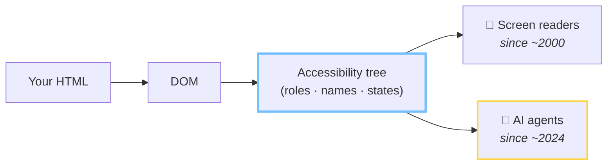

# Three ways to read a page

<div class="three-col">
<v-clicks>

<div class="read-card">
  <h3>👁 Screenshots + vision</h3>
  <div class="read-viz" aria-hidden="true">🖼️</div>
  <ul>
    <li>expensive</li>
    <li>slow</li>
    <li>misreads dense layouts</li>
  </ul>
</div>

<div class="read-card">
  <h3>🧾 Raw DOM</h3>
  <div class="read-viz mono" aria-hidden="true">&lt;div&gt;&lt;div&gt;&lt;div&gt;&lt;span&gt;<br>&lt;div class="x9k"&gt;&lt;div&gt;<br>&lt;div&gt;&lt;div&gt;&lt;svg&gt;…</div>
  <ul>
    <li>thousands of noisy nodes</li>
    <li>wrappers, framework junk, no meaning</li>
  </ul>
</div>

<div class="read-card ring-accent-card">
  <h3>🌳 Accessibility tree</h3>
  <div class="read-viz mono" aria-hidden="true">heading "TrailRunner 3000"<br>button "Add to cart"<br>textbox "Email" (required)</div>
  <ul>
    <li>clean semantic map</li>
    <li><strong>roles, names, states</strong> — nothing else</li>
  </ul>
</div>

</v-clicks>
</div>

<p v-click class="punch-sm">A fourth path is being built: the site <em>declares</em> callable tools for agents — WebMCP.</p>

<p v-click class="src-note">Source: <a href="https://web.dev/articles/ai-agent-site-ux" target="_blank" rel="noopener noreferrer">Google web.dev, "Build agent-friendly websites"</a> · 2026 · AX-tree parsing reported ~93% more token-efficient than raw DOM (<a href="https://isagentready.com/en/blog/how-ai-agents-see-your-website-the-accessibility-tree-explained" target="_blank" rel="noopener noreferrer">isagentready.com</a>)</p>

---

# The pipeline



<p v-click class="punch">Same tree. New consumer.</p>

---

# Don't take my word for it

<div class="vendor-grid">
<v-clicks>

<div class="vendor-card">
  <h3>ChatGPT Atlas <span class="dim">· OpenAI</span></h3>
  <p><strong>A11y tree.</strong> Looks elements up by role + accessible name.</p>
</div>

<div class="vendor-card">
  <h3>Playwright MCP <span class="dim">· Microsoft</span></h3>
  <p><strong>A11y tree.</strong> Snapshot by default, vision only on request.</p>
</div>

<div class="vendor-card">
  <h3>Claude in Chrome <span class="dim">· Anthropic</span></h3>
  <p><strong>A11y tree.</strong> Its page-reading tool returns a tree view of the page.</p>
</div>

<div class="vendor-card">
  <h3>Computer-Using Agent <span class="dim">· OpenAI</span></h3>
  <p><strong>Combo.</strong> Vision + raw DOM + a11y tree, ARIA data first.</p>
</div>

</v-clicks>
</div>

<p v-click class="src-note">Sources: vendor docs & READMEs · <a href="https://nohacks.co/blog/how-ai-agents-see-your-website" target="_blank" rel="noopener noreferrer">nohacks.co "How AI agents see your website"</a> · 2026</p>

<!-- TODO(Tim): pick real X/Bluesky post IDs and/or capture doc screenshots into public/, then swap these cards for <PostEmbed fallback="/vendor-atlas.png" postUrl="…" /> -->

---

# What people equip agents with

<div class="vendor-grid">
<v-clicks>

<div class="vendor-card">
  <h3>agent-browser <span class="dim">· Vercel Labs</span></h3>
  <p><strong>A11y tree.</strong> Snapshot lists <code>button "Submit" [ref=e2]</code> — the agent clicks <code>@e2</code>, not pixels on screen.</p>
</div>

<div class="vendor-card">
  <h3>Chrome DevTools MCP <span class="dim">· Google</span></h3>
  <p><strong>A11y tree.</strong> Text snapshot with uids; the docs say prefer it over a screenshot.</p>
</div>

<div class="vendor-card">
  <h3>Playwright MCP <span class="dim">· Microsoft</span></h3>
  <p><strong>A11y tree.</strong> Same default as a slide ago; vision is opt-in.</p>
</div>

<div class="vendor-card">
  <h3>browser-use <span class="dim">· open source</span></h3>
  <p><strong>DOM + a11y tree.</strong> Merges the DOM with roles and names from CDP; screenshots only when asked.</p>
</div>

</v-clicks>
</div>

<p v-click class="punch">Same default</p>

<p v-click class="src-note">READMEs & docs, Aug 2026 · <a href="https://github.com/vercel-labs/agent-browser" target="_blank" rel="noopener noreferrer">vercel-labs/agent-browser</a> · <a href="https://github.com/ChromeDevTools/chrome-devtools-mcp/blob/main/docs/tool-reference.md" target="_blank" rel="noopener noreferrer">ChromeDevTools/chrome-devtools-mcp</a> · <a href="https://github.com/microsoft/playwright-mcp" target="_blank" rel="noopener noreferrer">microsoft/playwright-mcp</a> · <a href="https://docs.browser-use.com/customize/agent-settings" target="_blank" rel="noopener noreferrer">browser-use docs</a></p>

---

# 🦞 OpenClaw — and how it reads a page

<div class="two-col-loose">

<div>

<v-clicks>

- **What** — open-source personal agent, running on your own machine with your files, your shell and its own browser.
- **Scale** — **386k stars** since Nov 2025. React has 247k, since 2013.
- **How it reads** — snapshot with refs (`[ref=e12]`); ARIA mode returns the accessibility tree. Screenshots **opt-in**.

</v-clicks>

</div>


</div>

<p v-click class="punch">The fastest-growing repo on GitHub navigates by role and name.</p>

<p class="src-note"><a href="https://star-history.com/#openclaw/openclaw&amp;react/react&amp;Date" target="_blank" rel="noopener noreferrer">star-history.com</a> · star counts from the GitHub API, 14 Aug 2026 · <a href="https://docs.openclaw.ai/tools/browser" target="_blank" rel="noopener noreferrer">docs.openclaw.ai/tools/browser</a></p>

---
hide: true
---

# The other direction: sites declaring tools

<div class="two-col-loose">

<div>

```js
await document.modelContext.registerTool({
  name: 'add_to_cart',
  description: 'Add a product to the cart',
  inputSchema: {
    type: 'object',
    properties: { sku: { type: 'string' } },
    required: ['sku'],
  },
  execute: async ({ sku }) => addToCart(sku),
})
```

</div>

<div>

<v-clicks>

- **Status** — Google + Microsoft proposal, draft in a W3C community group
- **Support** — **Chrome 149 origin trial** since June 2026 · Edge behind a flag · Firefox and Safari uncommitted
- **Framing** — Chrome: a *progressive enhancement*. The explainer: **"not designed for ingestion by accessibility technology"**
- **Reality** — deployment on real sites ≈ 0

</v-clicks>

</div>
</div>

<p v-click class="punch">A second channel, not a replacement — no tools, and the agent is back in the tree.</p>

<p class="src-note"><a href="https://developer.chrome.com/docs/ai/webmcp" target="_blank" rel="noopener noreferrer">developer.chrome.com/docs/ai/webmcp</a> · <a href="https://github.com/webmachinelearning/webmcp" target="_blank" rel="noopener noreferrer">github.com/webmachinelearning/webmcp</a> · Aug 2026 — re-verify before the talk</p>

---

# See it yourself

<div class="two-col-loose shot-right">

<div>

1. Chrome DevTools → **Elements**
2. Sidebar → **Accessibility** pane
3. Settings → *"Enable full-page accessibility tree"* for the whole-tree view

</div>


</div>

---

# The original users of this tree

<p class="at-lead">The browser has exposed this tree since about 2000. Until 2024 everything reading it was assistive technology, driven by a person.</p>

<div class="at-grid">
<v-clicks>

<figure class="at-card at-card-reader">
  
  <figcaption>
    <h3>Screen readers</h3>
    <p>Announce the <strong>role, name and state</strong> of every node. JAWS, NVDA, VoiceOver, TalkBack.</p>
  </figcaption>
</figure>

<figure class="at-card at-card-braille">
  
  <figcaption>
    <h3>Braille displays</h3>
    <p>The same names, raised as dots under the fingers — 40–80 cells at a time.</p>
  </figcaption>
</figure>

<figure class="at-card at-card-switch">
  
  <figcaption>
    <h3>Switch access</h3>
    <p>One or two controls step through the focusable elements, in tree order.</p>
  </figcaption>
</figure>

<figure class="at-card at-card-sippuff">
  
  <figcaption>
    <h3>Sip-and-puff</h3>
    <p>Same elements, same order, driven by breath and lip pressure instead of a mouse.</p>
  </figcaption>
</figure>

<div class="at-card at-stat" v-click>
  <p class="at-stat-value">1.3 billion</p>
  <p class="at-stat-label">people — 16% of the world — live with a significant disability.</p>
</div>

</v-clicks>
</div>

<p class="src-note">Sources: <a href="https://www.w3.org/WAI/people-use-web/" target="_blank" rel="noopener noreferrer">W3C WAI, "How People with Disabilities Use the Web"</a> · <a href="https://www.who.int/news-room/fact-sheets/detail/disability-and-health" target="_blank" rel="noopener noreferrer">WHO</a>, 7 Mar 2023 · Photos: <a href="https://www.flickr.com/photos/21406738@N08/3362181125" target="_blank" rel="noopener noreferrer">swissmiss studio CC BY 2.0</a>, <a href="https://commons.wikimedia.org/wiki/File:Plage-braille.jpg" target="_blank" rel="noopener noreferrer">S. Delorme CC BY-SA 3.0</a>, <a href="https://commons.wikimedia.org/wiki/File:InclusiveGameLab_Person-Using-Adaptive-Controller_2_CC-BY-SA.jpg" target="_blank" rel="noopener noreferrer">InclusiveGameLab CC BY-SA 4.0</a></p>

---

# Live: what the agent sees

<AgentView snippet="product-card" variant="fixed" height="330px" />
